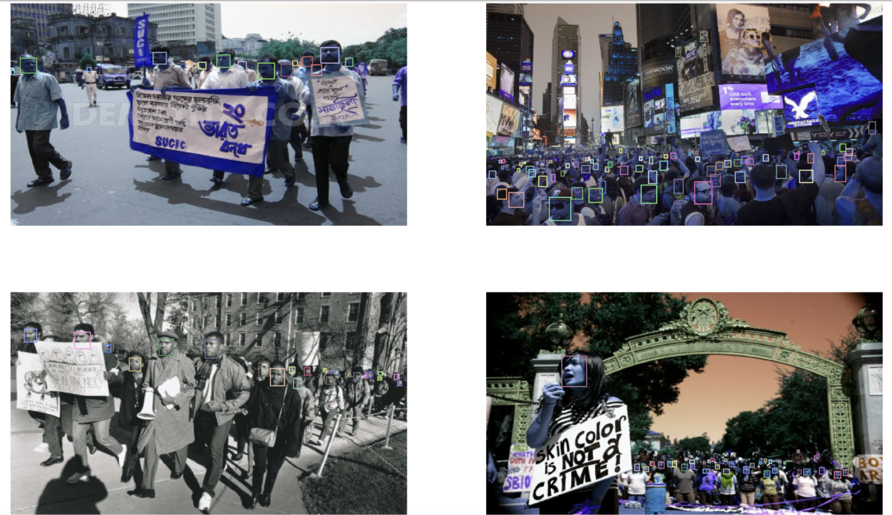
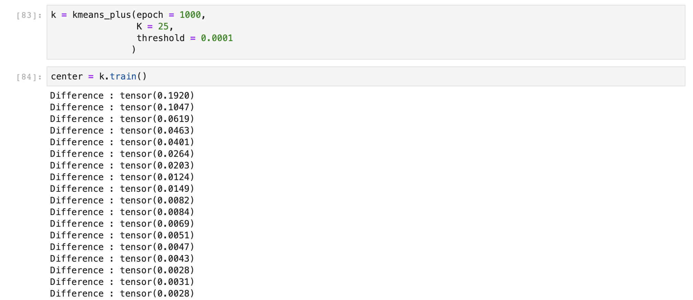
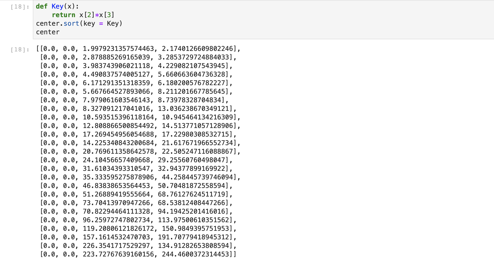
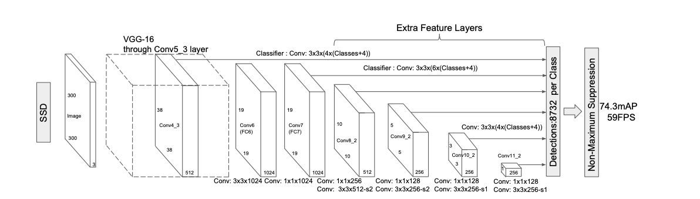
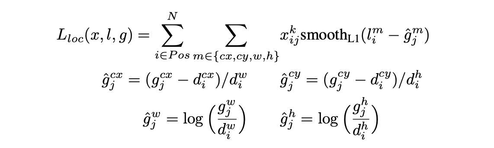
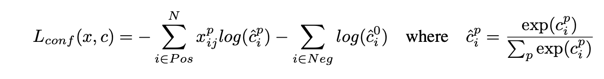
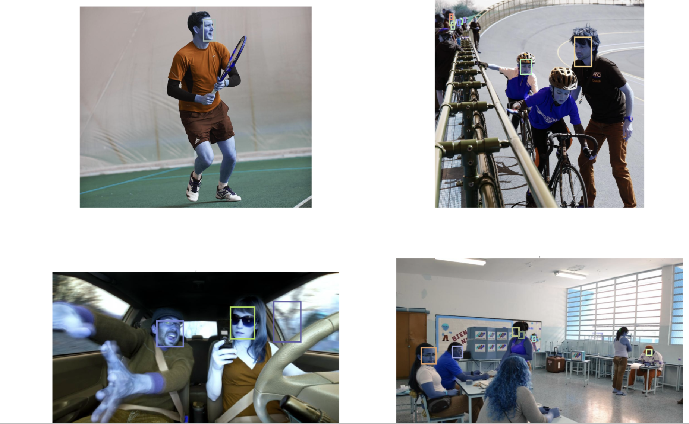

### 基于SSD算法的人脸检测

1、使用滑动窗口进行穷举提取候选窗来输入分类网络

2、使用CNN提取proposal windows 再输入分类网路，还有很多类似思想的网络，会应用到NMS和FPN金字塔特征提取等算法，有些会将proposal windows的提取和分类放在一起进行如MTCNN。

3、使用anchor box进行匹配，会使用K-means算法来从训练集来确定初始anchor box的大小形状，然后通过卷积生成的C * S*S的feature map中进行anchor box匹配，生成的每个特征点C向量代表一个网格的所有anchor box偏移量与分类向量和有无物体的confidence组成。也会用到NMS和FPN等算法。


## SSD算法：

### 1、预处理数据集

（1）首先处理数据集，因为最终应用场景视频为长方形图片shape为(1920,1080)，故去除数据集中形状差异较大的图片，只保留.mat文件中file_list和box 长宽比例在(0.4,0.7)之间的即可。

（2）最终模型训练我们使用图片大小为(480,270)，所以需要直接将坐标标签换算到reshape后的图片中，以便于搜索预选框。注意换算标签时要保留小数，因为数据集中有很多的小目标。

（3）检查处理后的数据是否错误

```python
m = loadmat("./WIDER_train/train.mat")
data = m['face_bbx_list']
img_name = m['file_list']
filename = os.listdir('./WIDER_train/images')
filename.sort()
img_paths = ['./WIDER_train/images/'+filename[12]+'/'+i[0][0]+'.jpg' for i in img_name[12][0]]
img_path = img_paths[0:4]
plt.figure(figsize=(80,50))
size = int(math.sqrt(len(img_path))+0.9999999999)
color = [i*0.01 for i in range(30,100)]
for i,path in enumerate(img_path):
    img = cv.imread(path)
    img = cv.resize(img,(480,270))
    boxes = data[12][0][i][0]
    for box in boxes:
        box[0] = round(box[0])
        box[1] = round(box[1])
        box[2] = round(box[2])
        box[3] = round(box[3])
            
    plt.subplot(size,size,i+1)
    plt.imshow(img)
    for j,box in enumerate(boxes):
            plt.gca().add_patch(
                plt.Rectangle((box[0],box[1]),box[2],box[3],
                              edgecolor=[random.choice(color),random.choice(color),random.choice(color)],
                              fill=False, linewidth=2))
    plt.axis('off')
plt.show()
```



（4）数据集选用开源的widerface数据集。

预处理代码在***Data_preprocessing.ipynb***中

### 2、k-means++算法得到k个预选框的大小和比例

使用k-means++算法挑选预选框，k-means原理是随机从训练集中抽取k个数据，然后计算每个剩余数据与k个预选数据的距离，与剩余数据距离最小的预选数据便是其类别，然后将每个类别的数据平均更新k个预选数据中心重新进行聚类，循环往复直至k个聚类中心基本无法更新。k-means++是优化了k-mean中的初始化方式，其不再直接随机抽取k个中心，而是先随机抽取1个，然后根据剩余数据与第一个聚类中心的距离尽量与之距离大的作为第二个初始聚类中心，这样可以加速之后的收敛，在算法实现中我是随机打乱数据集抽取前100个数据，然后取与已抽取的n个（n<k）初始聚类中心最大距离的数据作为第n+1个聚类中心。

具体算法实现在***K-means.ipynb***中，我选取k=25，停止阈值threshold=0.0001，分类距离D使用1-IOU来计算，由于我们的目的是得到预选框的大小和比例，所以，左上角坐标全部移动到(0,0)来计算IOU，即去除位置信息。

训练过程：



结果得到的25个预选框，按照面积大小排序：



之后根据选择的backbone网络来给不同的层分配预选框

### 3、模型

原文中的backbone是使用vgg16模型，截取了conv1_1到conv4_3的卷积，这里只要是分类网络的backbone基本都行，然后后面接逐渐缩小feature map的卷积层，选用了6层feature map作为预测特征，这6层feature map会经过detector变为channels为一定值(n*(4个offset+分类数+1个background))的feature map。

模型如下：



SSD中6层网络每一层的feature map中的每个点分别预测4 6 6 6 4 4个候选框，而我们使用5 4 4 4 4 4的方式将之前k-means算法得到的候选框按照面积分配给6个卷积feature map。

6层feature map的size如下

```python
torch.Size([-1, 512, 33, 60])
torch.Size([-1, 1024, 17, 30])
torch.Size([-1, 512, 9, 15])
torch.Size([-1, 256, 5, 8])
torch.Size([-1, 256, 3, 6])
torch.Size([-1, 256, 1, 4]) 
```

最终会有12728个detection

模型在***model.py***中

### 4、根据6层feature map的大小构造候选框的坐标

（1）计算中心坐标：

center = (i+0.5, j+0.5) / (size[0],size[1])*(270,480)，size为feature map大小，i，j为像素坐标 i, j  ∈ [0, size)

（2）将之前k-means算法得到的预选框宽高信息插入即可得到6层feature map中每个像素点对应的几个候选框的坐标(x,y,w,h)

代码如下

```python
def center(feature_map_size, box_num, box_size):
    '''
    得到box_coordinate为12728个预选框的坐标list
    list长度为12728，元素为[x,y,w,h],顺序为feature map由大到小
    每层feature map中的顺序为像素点由左到右，再由上到下
    每个像素点中的顺序为预选框大小由小到大
    '''
    box_coordinate = []
    index = 0
    for k, feature_map in enumerate(feature_map_size):
        box_size_son = box_size[index:index+box_num[k]]
        for i in range(feature_map[0]):
            for j in range(feature_map[1]):
                h_coor = (i+0.5)/feature_map[0]*270
                w_coor = (j+0.5)/feature_map[1]*480
                for num in range(box_num[k]):
                    box_coordinate.append([w_coor, h_coor]+box_size_son[num])
        index += box_num[k]
    return box_coordinate
```

（3）模型的输出最后也要将detection按通道分成class和localization两部分，然后按照预选框坐标的排列顺序view，以便于之后计算分类损失和localization损失。即分类detection view成[batch,12768,2] localization detection view成[batch, 12768, 4], 第二个维度12768要按照顺序。维度变换一定要注意预选框的顺序问题。

### 5、数据生成

（1）数据输入到模型中的是普通图片通量，但是由于我们想要模型预测的数据是offset和分类信息，所以标签在输入模型时要进行处理，需要将每一张图片的每一个true box与预选框的IOU，将每个true box对应最大IOU的预选框设为Pos，然后将与true box的IOU大于0.5的预选框也设为pos，其他预选框为Neg，设为Pos的预选框负责预测其对应的true box，然后计算这些预选框到其对应true box的offset，计算localization loss时也只计算这些，计算分类loss时Pos为类别，Neg为背景。

(2)所以说数据生成时，将offset存到一个通量中，还要伴随一个Judge∈{0,1}的通量，用来判断预选框的Pos和Neg，用来计算localization loss和class loss，当分类中还有多个类别n时，Judge∈{i for i in rang(n)}。

代码可见：***data_generator.py***


### 6、train

localization loss：



class loss：



总loss：


文中α = 1

我的α=2

Loss：如下

```python
def Loss(self, class_sum, loc_sum, Offset, Judge1, Judge2):
  '''
  class_sum shape[batch,12728,2] Tensor
  loc_sum shape[batch,12728,4] Tensor
  Offset shape[batch,12728,4] Tensor
  Judge1 shape[batch,12728,1] Tensor
  Judge2 shape[batch,12728] LongTensor
  '''
  Loss_con = torch.nn.CrossEntropyLoss(weight = 
                                  torch.Tensor([0.0003,1]),reduction='none').to(self.device)
  Loss_loc = torch.nn.SmoothL1Loss(reduction='none').to(self.device)
  w = 1/torch.sum(Judge1,dim=1).unsqueeze(-1)
  v = w.squeeze(-1).expand(w.shape[0],Judge2.shape[1]).contiguous().view(-1)
  loss_l = 2*torch.sum(Loss_loc(loc_sum*Judge1, Offset)*w)/self.batch
  loss_c = torch.sum(Loss_con(class_sum.view(-1,2),Judge2.view(-1))*v)/self.batch
  return loss_l,loss_c
                          
```

class_sum：模型输出的分类通道

 loc_sum：模型输出的定位通道

Offset：标签offset

 Judge1：生成的标签，用于计算1/N，与loc_sum相乘，去除置信度为0的框

Judge2：和Judge1一样用于计算loss

由于Neg比Pos多很多，所以权值设为[0.001,1]

由于训练中遇到localization loss不断升高的现象，怀疑是梯度过大，故采用了梯度裁剪，阈值设为10，但后来由于其太费训练时间且效果并不好故去除。

具体训练代码在***train.py***中

### 7、inference

（1）通过model输出的每个候选框的confidence来挑选n个候选框索引[0,12728)，然后得到预选框的坐标， 使用之前center函数得到的list可得到。

（2）再通过model输出的offset和预选框坐标预测人脸位置坐标。

（3）通过NMS算法去除重叠过多的预测框得到最终预测框。

代码可见***inference.py***

### 8、调优

（1）由于实际应用场景人数较少，故在训练时过采样了人数小于4个的数据，并且将预选框的确定IOU阈值设置到了0.6，以便于不会出现过多预选框去负责检测人脸。

（2）NMS算法中的阈值1（筛选预测框集合的阈值）设置到0.98可以对场景人数较少时的人脸检测有很好的效果，阈值2（减少预测框）设置到0.3，可以在人脸不是很密集的场景有较好效果。

（3）使用了滤波、亮度、对比度、加减像素等数据增强，另外由于最终应用场景测试时容易丢失人脸的下半部分，因为好多人喜欢用手扶住下巴之类的，而训练数据集中基本没有这种情况，所以训练时对数据集中的较大人脸的下半部分进行随机丢失的增强。

（4）经过测试置信度0，1的权值设为0.01，1效果较好。

（5）置信度交叉熵loss和定位loss的权值设为1，10。

（6）加入了UDA（对抗领域自适应）的方法用最终实际场景中的图片来做无监督学习来限制模型输出域，让模型在实际使用有更好的效果。

### 9、测试

（1）实际应用场景


（2）WIDER的测试集



​		由于训练的侧重方向和NMS的筛选阈值的设置有利于我们实际应用场景的检测，因此在WIDER测试集上的多人脸检测效果不是很好。但在我们的实际应用中效果较好。
